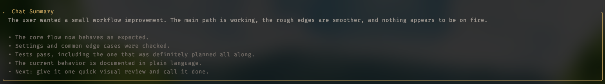

# Chat Summary

A [Pi](https://pi.dev) extension that keeps a concise, rolling session recap in the conversation transcript so the current goal, progress, and important decisions stay easy to scan.

<p align="center">
  
</p>

## What it does

- Shows a short recap followed by up to five focused bullet points.
- Updates automatically after completed turns or manually with `/summary refresh`.
- Keeps only the latest cumulative summary visible and follows session branches.
- Uses plain language and excludes tool calls and tool results by default.
- Supports global settings, trusted project overrides, and editable summary guidance.

## Install

```bash
pi install npm:@sanif/pi-chat-summary
```

Or install from GitHub:

```bash
pi install git:github.com/sanif/pi-chat-summary
```

## Usage

- `/summary` — view the current summary
- `/summary refresh` — regenerate it
- `/summary settings` — manage feature toggles
- `/summary prompt` — manage summary guidance
- `/summary help` — show all commands

Configuration is loaded from `~/.pi/agent/chat-summary.json` and, for trusted projects, `<project>/.pi/chat-summary.json`.

## Privacy and cost

Summary generation is separate from the main transcript and may incur model-provider cost. Privacy-safe diagnostics never include conversation or summary text.

## Development

```bash
bun install
bun run verify
```

## License

MIT
